<!-- ═══════════════════════════════════════════════════════════════════
     PROFILE README  ·  github.com/DeriaL
     Repo: DeriaL/DeriaL — must stay PUBLIC or the profile renders blank.
     Every other repo is private, so this links to live products
     instead of source. No Actions, no tokens, nothing that can break.
     ═══════════════════════════════════════════════════════════════════ -->

**Founder & AI Engineer at [Synelo Studio](https://www.synelostudio.com)** —
production AI for European businesses. Based in Prague.

I run three products at once, solo — an AI development studio, a security scanner
and a consumer app. No team, no round, no investors. AI is the leverage that makes
that arithmetic work, and the three feed each other: a lead-routing pattern built
for a studio client on Monday becomes a feature in the consumer app by Wednesday.

> [!NOTE]
> **AI projects don't break because the model is bad. They break because the demo
> was never the system.** Permissions, fallbacks, monitoring, human handoff, audit
> trails, rollback — the boring parts. In production, the boring parts are the product.

## The three

| | What it is | Live |
|---|---|---|
| **Synelo Studio** | AI-native dev studio for European SMBs. Fixed price, fixed ship date, code yours on day one. | [synelostudio.com](https://www.synelostudio.com) |
| **Bryxe** | Security and compliance scanner for AI-generated code. 4 detection layers, 7 EU frameworks. | [bryxe.app](https://bryxe.app) |
| **DayriOS** | AI life OS — tasks, habits, finance and a coach that messages you every morning on Telegram. | [dayrioslife.com](https://dayrioslife.com) |

Plus [**Synelo Academy**](https://synelo-academy.com) — teaching the same trade to
the next cohort, CS/EN.

## 🏛 Synelo Studio

An independent EU studio that ships production AI systems in **5–21 days at a fixed
price**, with EU AI Act, European Accessibility Act and NIS2 compliance built into
every deliverable. **26 productised packages**, €490 to €29,990 — no discovery
quarter, no hourly billing, no scope creep.

**What I actually built to make that possible**

- **AI Architect** — Claude-driven async intake. Client describes the pain, it asks
  five sharp questions, matches 2–3 packages from the real catalog, freezes price and
  ship date, generates the SOW PDF and mints the Stripe link. Two minutes, zero calls.
- **Client portal** — a private hub per project: live kanban, one-click approvals from
  the card, Telegram alerts on every status change, UI in 10 locales.
- **AIRS** — free site scan with a **publicly published scoring formula**, benchmarked
  against the client's sector.
- **The SOW is 14 lines, not 14 pages.** Every line is a verifiable boolean:
  *"agent responds in WhatsApp within 30s — true/false."*

**Three pacts, signed into the contract — not marketing**

| Pact | Commitment |
|---|---|
| **01 · On time or 50% back** | Miss the deploy date locked in the SOW and half the fee is refunded automatically |
| **02 · Day-one IP transfer** | Code, infra and keys in the client's accounts from hour one. If they can't export something in 30 seconds, that's a violation |
| **03 · 14-day care window** | Unlimited fixes after go-live, included. Retainers stay optional — production access is never held hostage |

### Selected client outcomes

Every number below is from a shipped system, not a pitch deck.

| Client | Result | Shipped | Stack |
|---|---|---|---|
| **Claims Triage AI** · Swiss insurer | First-notice triage **8 h → 3 min**, regulator-grade audit log | 21 days | `Claude` `Python` `Airflow` |
| **Nexa Logistics** · 3 depots | Morning dispatch **90 min → 12 min** | 21 days | `n8n` `Claude` `Telegram` |
| **Valoria** · SaaS support | **74%** of tier-one tickets auto-closed | 6 days | `Claude` `Zendesk` `RAG` |
| **OrthoDent Brno** · dental clinic | No-shows **−43%** in two months; 6 of 10 cancellations refilled same day | 5 days | `WhatsApp API` `Twilio` `Claude` |
| **FixMaster CZ** · device repair | Lead → booked job **+62%**, agent books in UK/CZ/EN | 6 days | `Next.js` `Supabase` `Claude` |
| **CourtTime Arena** · 11 courts | Off-peak occupancy **+22%**, pricing rules editable without a developer | 8 days | `Next.js` `Stripe` `Claude` |
| **Salon Améa** · 6 stylists | **+31** recovered bookings/month from unanswered calls | 3 days | `WhatsApp API` `SMS` |
| **CrewLink Mobile** · field crew | Dispatch → on-site **23 min → 7 min** | 14 days | `Expo` `React Native` `Supabase` |

## 🛡 Bryxe

Legacy scanners look for syntax errors while AI generates whole attack chains. Bryxe
is built for the code Cursor, Claude, v0, Lovable and Copilot actually ship.

**Four detection layers, one scan, under a minute:**

1. **Static patterns** — 350+ rules across 20+ languages, including a dedicated
   *vibe-stack* pack: Supabase RLS, Next.js server actions, Stripe webhooks,
   Vercel AI SDK, Clerk, Drizzle, Expo.
2. **AST taint tracking + offensive AI** — real dataflow analysis on JS/TS via
   `@babel/parser`, plus Claude primed as a senior offensive-security engineer
   hunting chains: SSRF → IMDS → AWS takeover, IDOR → admin escalation,
   prompt injection, OAuth flaws.
3. **CVE matching** — 300,000+ CVEs via OSV.dev across npm, PyPI, Go, Maven,
   Cargo, NuGet, RubyGems.
4. **EU compliance grading** — GDPR, NIS2, EU AI Act, DORA, PCI DSS, SOC 2,
   ISO 27001. 64 mapped requirements with article references.

Then it fixes them: Claude generates minimal patches, you preview the diff, and it
opens a PR — or **blocks the risky one from merging** as a required GitHub check.
Output is audit-ready: PDF report, embeddable badge, article-by-article evidence.

`Next.js` · `Claude API` · `Prisma` · `Stripe` · `Resend` · `Sentry` · `OSV.dev`

## 🌅 DayriOS

Every planner waits for you to open it. This one comes to you — a Telegram digest
each morning with the day's plan, and a nudge when you stall.

Tasks with natural-language input, habits on Atomic Habits methodology, finance with
receipt scanning and bank-PDF import, voice notes with transcription, brain-dump that
sorts chaos into tasks, and **Life X-Ray** — burnout prediction from 90 days of your
own data. Free tier forever; Plus €18/mo, Pro €29/mo.

`Next.js` · `Supabase` · `Claude API` · `Telegram Bot API`

## How the studio actually delivers

```mermaid
flowchart LR
    SCAN["Free site scan<br/>public AIRS formula"] --> ARCH{{"AI Architect<br/>Claude · 5 questions"}}
    ARCH --> MATCH["Match 2-3 packages<br/>from the 26-item catalog"]
    MATCH --> SOW["SOW: 14 boolean lines<br/>price + ship date frozen"]
    SOW --> PAY[/"Stripe link · 50% deposit"/]
    PAY --> BUILD["Senior engineers x AI agents<br/>5-21 days · daily staging"]
    BUILD --> HAND[("Handover: code, infra,<br/>keys, IP — client's accounts")]
    HAND --> CARE["14 days unlimited fixes"]
    BUILD -. "miss the date, 50% refunded" .-> PAY
```

No discovery calls, no billable research months. Scope, price and date freeze at
signature — which only works because the catalog is real and the SOW is falsifiable.

## Stack

Boring infrastructure, sharp edges — tools picked to outlive the hype cycle.

- **Edge** — Vercel, Cloudflare (WAF, R2)
- **Product** — Next.js (App Router, RSC, streaming), TypeScript, Tailwind, Framer Motion
- **AI & agents** — Claude / GPT / Gemini, Vercel AI SDK, LangGraph, Inngest, pgvector
- **Data & auth** — Supabase (Postgres, RLS, realtime), Drizzle, Prisma, Neon, Upstash Redis
- **Observability & ops** — Sentry, Axiom, Stripe, GitHub Actions
- **Mobile** — React Native + Expo, Flutter + Riverpod
- **3D & motion** — Three.js, react-three-fiber, drei, postprocessing, GSAP, Lenis
- **Also** — Python, Airflow, n8n, Docker, C++

## Compliance, by default

Every deliverable ships mapped to **EU AI Act (Annex IV)**, **European Accessibility
Act / WCAG 2.1 AA**, **NIS2 (Art. 21)**, **ISO 27001:2022**, **NIST AI RMF 1.0** and
**SOC 2 Type II** controls, with GDPR Art. 28 processing agreements and EU hosting.
Synelo is an independent technical studio, not a Notified Body — we prepare the
technical file, the client signs their own declaration.

> [!IMPORTANT]
> **My repositories are private** — all of it is commercial client and product work.
> The links above go to the things running in production instead. Happy to walk
> through architecture, screen recordings and trade-offs on a call.

> [!TIP]
> **Studio has capacity for new engagements** — fixed price, fixed date, from €490.
> I'm also open to senior engineering / AI architecture roles and to partnerships
> where the two sides compound.

## Activity

Nearly all of my work lives in private repositories; the graph counts those commits.

---

**[gusarivan21@gmail.com](mailto:gusarivan21@gmail.com)** ·
[LinkedIn](https://www.linkedin.com/in/ivan-husar) ·
[Telegram](https://t.me/DeriaLL) ·
[hello@synelostudio.com](mailto:hello@synelostudio.com)

