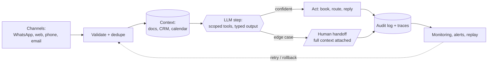

<!-- ═══════════════════════════════════════════════════════════════════
     PROFILE README  ·  github.com/DeriaL
     DeriaL/DeriaL must stay PUBLIC or the profile renders blank.
     banner / stats / chart / calendar are all generated into this repo —
     no third-party image services in the critical path.
     ═══════════════════════════════════════════════════════════════════ -->

I build AI automation for European businesses. The kind that still works on Monday
morning, when the data is messy and nobody is watching.

Mostly TypeScript and Next.js, Claude for the reasoning, Postgres underneath. Around
twenty systems are live right now: claims triage, dispatch, support deflection,
booking agents, a security scanner.

> [!NOTE]
> Every AI demo is beautiful, and that's the problem. In the demo the data is clean,
> the customer asks the right question, the API answers. Then Monday arrives — real
> users, timeouts, duplicate records, no logs, no owner. Projects don't die because
> the model is bad. They die because the demo was never a system.

**What I actually do all day**

- **AI automation.** Agents that take a job off someone's plate instead of helping with it. Booking, triage, routing, dispatch, wired into the tools a company already pays for.
- **AI products.** Where the model is one part and the rest is billing, auth, retries, cost ceilings and evals.
- **Web.** WebGL landings, multilingual funnels, programmatic SEO. Fast, because slow pages cost real money.

## Three main projects

### 🛡 [Bryxe](https://bryxe.app) — security scanner for AI-generated code

AI writes vulnerable code very quickly. I kept running into the same things: Stripe
keys pushed straight to production, Supabase tables with RLS quietly switched off,
IDOR that hands over the whole database in two requests. Meanwhile the old scanners
are still hunting for syntax mistakes while the model assembles full attack chains.

So I built Bryxe. One scan, under a minute, four layers deep:

- **350+ static patterns** across 20+ languages, plus a pack written specifically for the vibe-coding stack: Supabase RLS, Next.js server actions, Stripe webhooks, Vercel AI SDK, Clerk, Drizzle
- **Real dataflow analysis** on JS/TS through `@babel/parser`, with Claude running alongside it as an offensive-security engineer looking for chains: SSRF → IMDS → cloud takeover, IDOR → admin escalation, prompt injection
- **300,000+ CVEs** matched through OSV.dev across every major ecosystem
- **Seven EU frameworks graded** — GDPR, NIS2, AI Act, DORA, PCI DSS, SOC 2, ISO 27001, with the article references attached

Then it fixes what it found. Claude writes a minimal patch, you look at the diff, and
it opens a PR. Or it just blocks the bad one from merging as a required check.

`Next.js` · `Claude API` · `Prisma` · `Stripe` · `Sentry` · `OSV.dev`

### 🌅 [DayriOS](https://dayrioslife.com) — AI life operating system

I'm the guy who downloads his fifth planner, uses it for three days and forgets it
exists. So this one doesn't sit there waiting to be opened. It messages you on
Telegram every morning with the plan for the day, and pokes you when you stall.

Tasks in plain language, habits with streaks, finances with receipt scanning and bank
PDF import, voice notes, and a burnout forecast built from ninety days of your own
data.

The hard part was never the model. It was knowing when to shut up: on a bad day it
lowers the bar instead of nagging you.

`Next.js` · `Supabase` · `Claude API` · `Telegram Bot API`

### 🎓 [Synelo Academy](https://synelo-academy.com) — WebGL landing + course platform

A course on the AI trade, sold into Czechia and the wider EU with a CS/EN funnel.

The landing is the part I had fun with. Six tracks, six 3D scenes generated in code
from Three.js primitives — nothing bought, nothing downloaded. Scroll drives a GSAP
timeline through Lenis, and the centrepiece is a seven-node workflow graph with
pulses running down the wires.

`react-three-fiber` · `drei` · `postprocessing` · `GSAP` · `Lenis`

## Automation in production

Client systems, with numbers I can back up:

| System | Result | Shipped |
|---|---|---|
| Claims triage · Swiss insurer | First-notice triage **8 h → 3 min**, with an audit log a regulator will accept | 21 days |
| Dispatch copilot · 3 depots | Morning dispatch **90 min → 12 min** | 21 days |
| Support agent · SaaS | **74%** of tier-one tickets closed without a human | 6 days |
| No-show protection · clinic | No-shows down **43%** in two months | 5 days |
| Booking agent · device repair | Lead to booked job **+62%**, takes bookings in UK/CZ/EN | 6 days |

## How one of these is actually put together

The model call is a single box in the middle. Everything around it is the job:

Rules I don't break:

- Parse and validate whatever the model returns. Never use it raw.
- Every step has to be safe to run twice. A retry should not double-book anyone.
- Low confidence goes to a person, with the full context attached.
- If I can't see it in the traces, it doesn't ship.

## Stack

- **AI** — Claude API, GPT, Gemini, Vercel AI SDK, LangGraph, pgvector, RAG
- **Web** — Next.js, React, Vite, Tailwind, Radix, Framer Motion · Three.js, r3f, GSAP, Lenis
- **Data** — PostgreSQL, Supabase, Prisma, Drizzle, Neon, Redis
- **Automation & ops** — n8n, Airflow, WhatsApp / Telegram APIs, Stripe, Sentry, Docker, Vercel
- **Also** — Python, C++, React Native + Expo, Flutter

Everything ships mapped to **EU AI Act (Annex IV)**, **EAA / WCAG 2.1 AA**, **NIS2**,
**ISO 27001** and **SOC 2** controls. In this market that isn't paperwork, it decides
whether a feature is allowed to go live at all.

> [!IMPORTANT]
> All of my repositories are private — it's client and product work, so the code stays
> shut. The links above go to what's actually running instead. I'm happy to open up the
> architecture, walk through screen recordings and tell you what I'd do differently
> on a call.
>
> Currently taking on AI automation, AI product and web work — [synelostudio.com](https://www.synelostudio.com)

## Activity

  

  

Nearly all of those commits land in private repositories. The numbers come straight
from GitHub's own contribution data, pulled and drawn by
[a script in this repo](scripts/generate-stats.mjs) — so nothing above is typed by
hand or borrowed from someone else's server.

---

**[gusarivan21@gmail.com](mailto:gusarivan21@gmail.com)** ·
[LinkedIn](https://www.linkedin.com/in/ivan-husar) ·
[Telegram](https://t.me/DeriaLL)

