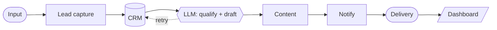

<!-- ═══════════════════════════════════════════════════════════════════
     PROFILE README  ·  github.com/DeriaL
     Goes in a NEW public repo named exactly: DeriaL
     No GitHub Actions or tokens needed — nothing here can break.
     ═══════════════════════════════════════════════════════════════════ -->

I build **AI automation products** end to end — the platform, the agent
workflows, the dashboard and the landing page that sells it. Mostly
TypeScript and Next.js, with Three.js when the interface needs to be
remembered, and Python for the parts that run unattended.

> [!NOTE]
> **Available for fullstack and AI automation work** — remote, full-time or project-based.
> Reach me at **gusarivan21@gmail.com**.

## What I'm building

**[AIRichLife](https://github.com/DeriaL/airichlife)** — AI business-automation
platform for European SMBs. 21 AI services, 7 demo types, an admin dashboard,
25-language i18n and 624+ programmatic SEO pages. Built to be found, not just
to exist.
`Next.js 16` · `TypeScript` · `Tailwind` · `Framer Motion`

**[VECTRA ACADEMY](https://github.com/DeriaL/Academy)** — WebGL landing for a
digital-skills academy. Six tracks, six **procedurally generated** 3D scenes
built from Three.js primitives — no paid assets, no downloaded models. Scroll
is tied to a GSAP timeline through Lenis.
`React` · `react-three-fiber` · `GSAP` · `Lenis` · `TypeScript`

**Vibe Shield** *(private)* — security scanner for AI-generated code.
216 vulnerability checks, AI auto-fix, and a signed certificate on pass.
`TypeScript`

## How I think about automation

The pattern under most of my work — and the centrepiece 3D scene in
VECTRA ACADEMY is literally this graph, animated:

Every arrow is a place things break in production, so every step is
idempotent and observable. That is most of the actual work.

## Selected private work

26 of my 32 repositories are private client and product work. A sample:

- **Synelo suite** — multi-app product family: studio, command center, prime landing, cold-outreach tooling, hotel booking integration · `TypeScript` `Next.js`
- **AI agents & autoposting** — generation, rewriting, scheduling and delivery pipelines running unattended · `TypeScript` `Node.js`
- **Coaching & service bots** — Telegram bots with onboarding, bookings, reminders, client history · `Python`
- **dayri-app · TravelProject** — cross-platform mobile apps · `Dart` `Flutter`

> [!TIP]
> Happy to walk through any of these on a call — screenshots and
> architecture, without the client's code.

## Stack

- **Core** — TypeScript, JavaScript, Python, Dart
- **Frontend** — Next.js, React, Vite, Tailwind, Framer Motion
- **3D** — Three.js, react-three-fiber, drei, GSAP, Lenis
- **AI** — LLM APIs, agent workflows, prompt pipelines
- **Backend & infra** — Node.js, PostgreSQL, Docker, GitHub Actions, Vercel

## Also public

[`aria-os`](https://github.com/DeriaL/aria-os) — AI assistant as a browser-based OS shell ·
[`BOT_TRAINER`](https://github.com/DeriaL/BOT_TRAINER) — Telegram training bot ·
[`Synelo-Hotel-Ryzlink`](https://github.com/DeriaL/Synelo-Hotel-Ryzlink) — booking front-end ·
[`ArmaRep`](https://github.com/DeriaL/ArmaRep) — site template

## Activity

---

**[gusarivan21@gmail.com](mailto:gusarivan21@gmail.com)**
<!-- add once you send them: · [LinkedIn](https://linkedin.com/in/HANDLE) · [Telegram](https://t.me/HANDLE) · [Portfolio](https://SITE) -->

