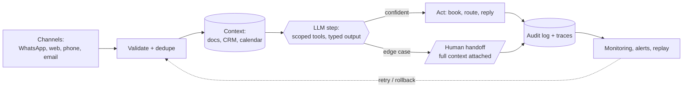

<!-- ═══════════════════════════════════════════════════════════════════
     PROFILE README  ·  github.com/DeriaL
     Repo: DeriaL/DeriaL — must stay PUBLIC or the profile renders blank.
     Banner is self-hosted (banner.svg) — no third-party image services
     in the critical path. Every other repo is private.
     ═══════════════════════════════════════════════════════════════════ -->

I build **AI automation, AI products and the web that carries them** — and I ship
them into production for European businesses, not into demo folders.

Twenty-plus live systems: claims triage, dispatch, support deflection, booking
agents, security scanning. Mostly **TypeScript, Next.js and Claude API**, on
Postgres, with the compliance paperwork done.

> [!NOTE]
> **AI projects don't break because the model is bad. They break because the demo
> was never the system.** Permissions, fallbacks, monitoring, human handoff, audit
> trails, rollback — the boring parts. In production, the boring parts are the product.

## What I do

<table>
<tr>
<td width="33%" valign="top">

### 🤖 AI Automation

Agents that remove a task instead of assisting with it. Booking, triage, routing,
support, dispatch — wired into the tools a business already uses, with a human
handoff path and an audit trail.

`Claude API` · `n8n` · `WhatsApp` · `Airflow`

</td>
<td width="33%" valign="top">

### 🧠 AI Products

Full products where the model is one component: scanners, coaches, copilots.
Retrieval, guardrails, typed outputs, cost ceilings, evals — plus billing,
auth and the migrations nobody demos.

`Claude API` · `pgvector` · `Prisma` · `Stripe`

</td>
<td width="33%" valign="top">

### 🌐 Web

Sites and app UIs that carry the pitch: WebGL landings, multilingual funnels,
programmatic SEO at scale, Lighthouse budgets treated as requirements rather
than aspirations.

`Next.js` · `Three.js` · `GSAP` · `next-intl`

</td>
</tr>
</table>

## Three main projects

### 🛡 [Bryxe](https://bryxe.app) — security scanner for AI-generated code

AI writes vulnerable code fast, and legacy scanners look for syntax errors while
AI generates whole attack chains. Bryxe is built for what Cursor, Claude, v0,
Lovable and Copilot actually ship.

**Four detection layers, one scan, under a minute:**

1. **Static patterns** — 350+ rules across 20+ languages, plus a dedicated
   *vibe-stack* pack: Supabase RLS, Next.js server actions, Stripe webhooks,
   Vercel AI SDK, Clerk, Drizzle, Expo.
2. **AST taint tracking + offensive AI** — real dataflow analysis on JS/TS via
   `@babel/parser`, plus Claude primed as a senior offensive-security engineer
   hunting chains: SSRF → IMDS → cloud takeover, IDOR → admin escalation,
   prompt injection, OAuth flaws.
3. **CVE matching** — 300,000+ CVEs via OSV.dev across npm, PyPI, Go, Maven,
   Cargo, NuGet, RubyGems.
4. **EU compliance grading** — GDPR, NIS2, EU AI Act, DORA, PCI DSS, SOC 2,
   ISO 27001 — 64 mapped requirements with article references.

Then it fixes them: Claude generates minimal patches, you preview the diff, and it
opens a PR — or **blocks the risky one from merging** as a required GitHub check.
Output is audit-ready: PDF report, embeddable badge, article-by-article evidence.

`Next.js` · `Claude API` · `Prisma` · `Stripe` · `Sentry` · `OSV.dev` · `Playwright`

### 🌅 [DayriOS](https://dayrioslife.com) — AI life operating system

Every planner waits for you to open it. This one comes to you: a Telegram digest
each morning with the day's plan, and a nudge when you stall.

Tasks with natural-language input, habits on Atomic Habits methodology with streaks,
finance with receipt scanning and bank-PDF import, voice notes with transcription,
brain-dump that sorts chaos into tasks, and **Life X-Ray** — burnout prediction from
90 days of your own data. Six AI personalities on the top tier; free tier stays free.

The interesting engineering problem here isn't the model — it's **restraint**:
lowering the bar on bad days instead of nagging, and keeping personal data private
while still giving the coach enough context to be useful.

`Next.js` · `Supabase` · `Claude API` · `Telegram Bot API` · `pdfjs`

### 🎓 [Synelo Academy](https://synelo-academy.com) — WebGL landing + course platform

A course teaching the AI trade, sold into the Czech and EU market through a
bilingual CS/EN funnel. The landing is the showcase piece: six tracks, six
**procedurally generated** 3D scenes built from Three.js primitives — no paid
assets, no downloaded models.

Scroll drives a GSAP timeline through Lenis; each scene floats, glows and reacts to
pointer parallax. The centrepiece is a seven-node AI workflow graph with pulses
travelling the connections, so it reads as live data flow rather than decoration.

`React` · `react-three-fiber` · `drei` · `postprocessing` · `GSAP` · `Lenis`

## AI automation in production

Client systems I built and shipped. Every number is measured, not projected.

| System | Result | Shipped | Stack |
|---|---|---|---|
| Claims triage · Swiss insurer | First-notice triage **8 h → 3 min**, regulator-grade audit log | 21 days | `Claude` `Python` `Airflow` |
| Dispatch copilot · 3 depots | Morning dispatch **90 min → 12 min** | 21 days | `n8n` `Claude` `Telegram` |
| Support agent · SaaS | **74%** of tier-one tickets auto-closed, handle time halved | 6 days | `Claude` `Zendesk` `RAG` |
| No-show protection · dental clinic | No-shows **−43%** in two months; 6 of 10 cancellations refilled same day | 5 days | `WhatsApp API` `Twilio` `Claude` |
| Booking agent · device repair | Lead → booked job **+62%**, books in UK/CZ/EN | 6 days | `Next.js` `Supabase` `Claude` |
| Dynamic pricing · 11 courts | Off-peak occupancy **+22%**, rules editable without a developer | 8 days | `Next.js` `Stripe` `Claude` |
| Missed-call capture · salon | **+31** recovered bookings/month from unanswered calls | 3 days | `WhatsApp API` `SMS` |
| Crew dispatch app · field service | Dispatch → on-site **23 min → 7 min** | 14 days | `Expo` `React Native` `Supabase` |

## How a production automation is actually built

The model call is a single box in the middle. Everything around it is the job:

Every step is idempotent and re-runnable, every decision is logged with its inputs,
and the handoff path exists before launch — not after the first incident.

## Engineering principles

- **Typed at the boundary.** Model output is parsed and validated, never trusted raw.
- **Idempotent by default.** Reruns are safe; retries can't double-book or double-charge.
- **Confidence gates, not vibes.** Low certainty routes to a human with context attached.
- **Cost is a constraint.** Token ceilings, caching and rate limits designed in, not discovered.
- **Observable or it doesn't ship.** Traces, structured logs, replayable events.
- **Evals over demos.** A change is an improvement only if it's measured on real cases.

## Stack

- **Core** — TypeScript, JavaScript, Python, Dart, C++
- **AI** — Claude API, GPT, Gemini, Vercel AI SDK, LangGraph, Inngest, pgvector, RAG
- **Frontend** — Next.js (App Router, RSC), React, Vite, Tailwind, Radix, Framer Motion
- **3D & motion** — Three.js, react-three-fiber, drei, postprocessing, GSAP, Lenis
- **Data** — PostgreSQL, Supabase, Prisma, Drizzle, Neon, Upstash Redis
- **Automation** — n8n, Make, Airflow, GitHub Actions, WhatsApp / Telegram APIs
- **Production** — Stripe, Resend, Sentry, Axiom, NextAuth, next-intl, Docker, Vercel
- **Mobile** — React Native + Expo, Flutter + Riverpod

## Compliance, by default

I ship AI features already mapped to **EU AI Act (Annex IV)**, **European
Accessibility Act / WCAG 2.1 AA**, **NIS2 (Art. 21)**, **ISO 27001:2022**,
**NIST AI RMF 1.0** and **SOC 2 Type II** controls, with GDPR Art. 28 processing
agreements and EU hosting. In this market that isn't paperwork — it's whether the
feature is allowed to go live.

> [!IMPORTANT]
> **My repositories are private** — it's commercial client and product work. The
> links above go to the things running in production instead. Happy to walk through
> architecture, screen recordings and trade-offs on a call.

> [!TIP]
> **Taking on AI automation, AI product and web work.** Name the process eating your
> team's week and I'll tell you what it costs to make it stop —
> [synelostudio.com](https://www.synelostudio.com)

## Activity

Nearly all of my work lives in private repositories; the graph counts those commits.

---

**[gusarivan21@gmail.com](mailto:gusarivan21@gmail.com)** ·
[LinkedIn](https://www.linkedin.com/in/ivan-husar) ·
[Telegram](https://t.me/DeriaLL)

