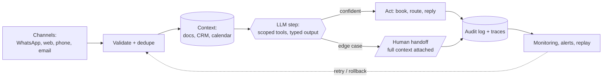

<!-- ═══════════════════════════════════════════════════════════════════
     PROFILE README  ·  github.com/DeriaL
     Repo: DeriaL/DeriaL — must stay PUBLIC or the profile renders blank.
     Banner is self-hosted (banner.svg). Every other repo is private.
     ═══════════════════════════════════════════════════════════════════ -->

I build **AI automation, AI products and the web that carries them**, and ship them
into production for European businesses. Twenty-plus live systems — claims triage,
dispatch, support deflection, booking agents, security scanning.

- **AI automation** — agents that remove a task instead of assisting with it, wired into the tools a business already uses
- **AI products** — scanners, coaches, copilots where the model is one component next to billing, auth and evals
- **Web** — WebGL landings, multilingual funnels, programmatic SEO, Lighthouse budgets treated as requirements

> [!NOTE]
> **AI projects don't break because the model is bad — they break because the demo
> was never the system.** Permissions, fallbacks, monitoring, human handoff, audit
> trails, rollback. In production, the boring parts are the product.

## Three main projects

### 🛡 [Bryxe](https://bryxe.app) — security scanner for AI-generated code

Legacy scanners look for syntax errors while AI generates whole attack chains.
Bryxe is built for what Cursor, Claude, v0 and Copilot actually ship — four layers
in one sub-minute scan:

- **350+ static patterns** across 20+ languages, plus a *vibe-stack* pack: Supabase RLS, Next.js server actions, Stripe webhooks, Vercel AI SDK, Clerk, Drizzle
- **AST taint tracking + offensive AI** — dataflow on JS/TS via `@babel/parser`, with Claude primed as an offensive-security engineer hunting chains: SSRF → IMDS → cloud takeover, IDOR → admin escalation, prompt injection
- **300,000+ CVEs** via OSV.dev across every major ecosystem
- **7 EU frameworks graded** — GDPR, NIS2, AI Act, DORA, PCI DSS, SOC 2, ISO 27001, with article references

Then it fixes them: Claude writes a minimal patch, you preview the diff, it opens a
PR — or **blocks the risky one from merging** as a required check.

`Next.js` · `Claude API` · `Prisma` · `Stripe` · `Sentry` · `OSV.dev`

### 🌅 [DayriOS](https://dayrioslife.com) — AI life operating system

Every planner waits for you to open it; this one comes to you — a Telegram digest
each morning, and a nudge when you stall. Tasks, habits, finance with receipt and
bank-PDF import, voice notes, and burnout prediction from 90 days of your own data.

The interesting problem isn't the model, it's **restraint**: lowering the bar on bad
days instead of nagging, while keeping personal data private enough to stay boring.

`Next.js` · `Supabase` · `Claude API` · `Telegram Bot API`

### 🎓 [Synelo Academy](https://synelo-academy.com) — WebGL landing + course platform

Bilingual CS/EN funnel for a course on the AI trade. Six tracks, six **procedurally
generated** 3D scenes built from Three.js primitives — no paid assets, no downloaded
models. Scroll drives a GSAP timeline through Lenis; the centrepiece is a seven-node
workflow graph with pulses travelling the connections.

`react-three-fiber` · `drei` · `postprocessing` · `GSAP` · `Lenis`

## Automation in production

Client systems I built. Every number measured, not projected.

| System | Result | Shipped |
|---|---|---|
| Claims triage · Swiss insurer | First-notice triage **8 h → 3 min**, regulator-grade audit log | 21 days |
| Dispatch copilot · 3 depots | Morning dispatch **90 min → 12 min** | 21 days |
| Support agent · SaaS | **74%** of tier-one tickets auto-closed | 6 days |
| No-show protection · clinic | No-shows **−43%** in two months | 5 days |
| Booking agent · device repair | Lead → booked job **+62%**, books in UK/CZ/EN | 6 days |

## How a production automation is actually built

The model call is one box in the middle. Everything around it is the job:

- **Typed at the boundary** — model output is parsed and validated, never trusted raw
- **Idempotent by default** — retries can't double-book or double-charge
- **Confidence gates, not vibes** — low certainty routes to a human, context attached
- **Observable or it doesn't ship** — traces, structured logs, replayable events

## Stack

- **AI** — Claude API, GPT, Gemini, Vercel AI SDK, LangGraph, pgvector, RAG
- **Web** — Next.js, React, Vite, Tailwind, Framer Motion · Three.js, r3f, GSAP, Lenis
- **Data** — PostgreSQL, Supabase, Prisma, Drizzle, Neon, Redis
- **Automation & ops** — n8n, Airflow, WhatsApp / Telegram APIs, Stripe, Sentry, Docker, Vercel
- **Also** — Python, C++, React Native + Expo, Flutter

Everything ships mapped to **EU AI Act (Annex IV)**, **EAA / WCAG 2.1 AA**, **NIS2**,
**ISO 27001** and **SOC 2** controls — in this market that decides whether a feature
is allowed to go live.

> [!IMPORTANT]
> **My repositories are private** — it's commercial client and product work, so the
> links above go to what's running in production instead. Happy to walk through
> architecture, screen recordings and trade-offs on a call.
>
> Taking on AI automation, AI product and web work — [synelostudio.com](https://www.synelostudio.com)

Contribution activity

 

Most of my commits are in private repositories, so the graph is a rough signal rather
than the whole picture.

---

**[gusarivan21@gmail.com](mailto:gusarivan21@gmail.com)** ·
[LinkedIn](https://www.linkedin.com/in/ivan-husar) ·
[Telegram](https://t.me/DeriaLL)

