<!-- ═══════════════════════════════════════════════════════════════════
     PROFILE README  ·  github.com/DeriaL
     Repo: DeriaL/DeriaL  (public, name matches the handle)
     No GitHub Actions or tokens needed — nothing here can break.
     ═══════════════════════════════════════════════════════════════════ -->

I build **AI-driven products that have to make money** — not demos. Over the last
year that meant a commercial security scanner with real billing, and a four-system
growth platform that finds leads, writes the outreach, publishes the content and
reports its own unit economics.

Mostly **Next.js + TypeScript**, **Claude API** for the reasoning layer,
**Supabase / Postgres** underneath, and **Three.js** when the interface is the pitch.

> [!NOTE]
> **Available for fullstack and AI automation work** — Prague or remote,
> full-time or project-based. Reach me at **gusarivan21@gmail.com**.

## What I'm building

### 🛡 Bryxe Shield · *private*

Security and compliance scanner for AI-generated code — the problem nobody had
three years ago and everybody has now.

**300+ security checks · 300,000+ CVEs · 7 EU compliance frameworks · one scan.**
Four ways in: upload a ZIP, connect a GitHub repo, scan a live URL, or run the CLI.
Out comes an OWASP-aligned report with CVE matches across every major ecosystem and
AI-detected logic flaws that pattern matching cannot see.

Shipped as a real SaaS, not a side project: Stripe billing, transactional email,
error tracking, migrations.

`Next.js` · `Claude API` · `Prisma` · `Stripe` · `Resend` · `Sentry`

### ⚙️ Synelo — four systems and one command centre · *private*

An end-to-end growth platform I built for my own studio. Each part is a product;
together they close the loop from stranger to paying client.

| System | What it does |
|---|---|
| **Outreach** | Finds leads through Google Places across **12 niches × 10 Czech cities**, audits each site for weak signals — no GTM, no chat, no booking, missing alt tags — then has Claude write outreach that references what it actually found |
| **Autopilot** | Generates visuals and per-network copy, routes them through review and approval, publishes to **Instagram, LinkedIn, Threads and X**. Runs on mock providers so the whole flow is demoable without a single API key |
| **Marketing Machine** | Tracks every visitor step, surfaces where the funnel leaks, feeds a lead CRM, computes campaign unit economics, and runs an **AI analyst every three hours** |
| **Command Centre** | One dashboard over all four: cross-system funnel, unified event feed, per-project KPIs and an AI briefing — replacing four separate Telegram streams |

`Next.js 15` · `Claude API` · `Gemini` · `Supabase` · `Google Places` · `next-intl`

### 🎨 [VECTRA ACADEMY](https://github.com/DeriaL/Academy) · *public*

WebGL landing for a digital-skills academy. Six tracks, six **procedurally
generated** 3D scenes — built from Three.js primitives, no paid assets and no
downloaded models. Scroll drives a GSAP timeline through Lenis.

`react-three-fiber` · `drei` · `postprocessing` · `GSAP` · `Lenis`

### 🧠 [AIRichLife](https://github.com/DeriaL/airichlife) · *public*

AI business-automation platform aimed at European SMBs. 21 AI services, 7 demo
types, an admin dashboard, **25-language i18n** and **624+ programmatic SEO pages** —
built to be found, not just to exist.

`Next.js 16` · `TypeScript` · `Tailwind` · `TipTap` · `Framer Motion`

## How the growth loop fits together

Not a diagram of an idea — this is what the Synelo systems actually do:

```mermaid
flowchart LR
    PLACES[("Google Places<br/>12 niches x 10 cities")] --> AUDIT["Site audit:<br/>GTM, chat, booking, alt"]
    AUDIT --> MAIL{{"Claude:<br/>write the outreach"}}

    BRIEF["Visual + copy<br/>per network"] --> APPROVE["Review / approve"]
    APPROVE --> PUB["IG · LinkedIn · Threads · X"]

    MAIL --> TRACK["Visitor tracking"]
    PUB --> TRACK
    TRACK --> FUNNEL["Funnel + leak points"]
    FUNNEL --> CRM[("Lead CRM")]
    CRM --> ECON["Campaign unit economics"]
    ECON --> ANALYST{{"AI analyst<br/>every 3 hours"}}
    ANALYST --> CC[/"Command Centre"/]
    CC -. "what to fix next" .-> BRIEF
```

Every arrow is somewhere things break in production, so each step is idempotent,
logged and re-runnable. That is most of the actual work — the AI call is the easy part.

## Also built

- **koval-coach** — coaching platform: NextAuth, Prisma on Neon Postgres, before/after progress slider, QR onboarding
- **aria-os · dayri-app** — React + Vite apps on Supabase with TanStack Query, zustand, react-hook-form + zod, in-browser PDF parsing
- **TravelProject** — Flutter travel app: Riverpod, go_router, Supabase, MapLibre GL
- **Telegram bots** — training and coaching flows: onboarding, bookings, reminders, client history

## Stack

- **Core** — TypeScript, JavaScript, Python, Dart
- **Frontend** — Next.js, React, Vite, Tailwind, Radix, Framer Motion
- **3D** — Three.js, react-three-fiber, drei, postprocessing, GSAP, Lenis
- **AI** — Claude API, Gemini, prompt pipelines, scheduled AI analysis
- **Data** — Supabase, PostgreSQL, Prisma, Neon
- **Production** — Stripe, Resend, Sentry, NextAuth, next-intl, Docker, Vercel
- **Mobile** — Flutter, Riverpod

## Public repositories

[`Academy`](https://github.com/DeriaL/Academy) — VECTRA ACADEMY, WebGL landing ·
[`airichlife`](https://github.com/DeriaL/airichlife) — AI automation platform ·
[`aria-os`](https://github.com/DeriaL/aria-os) — Supabase app shell ·
[`BOT_TRAINER`](https://github.com/DeriaL/BOT_TRAINER) — Telegram training bot ·
[`Synelo-Hotel-Ryzlink`](https://github.com/DeriaL/Synelo-Hotel-Ryzlink) — booking front-end ·
[`ArmaRep`](https://github.com/DeriaL/ArmaRep) — site template

> [!TIP]
> 26 of my 32 repositories are private client and product work. Happy to walk
> through any of it on a call — architecture and screenshots, without the code.

## Activity

---

**[gusarivan21@gmail.com](mailto:gusarivan21@gmail.com)** ·
[LinkedIn](https://www.linkedin.com/in/ivan-husar) ·
[Telegram](https://t.me/DeriaLL)

